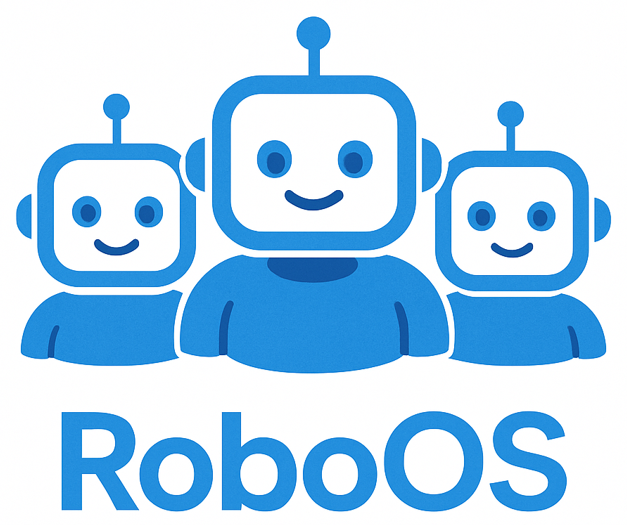
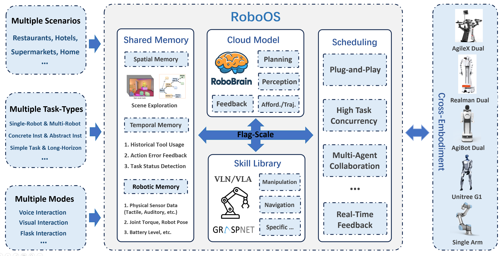
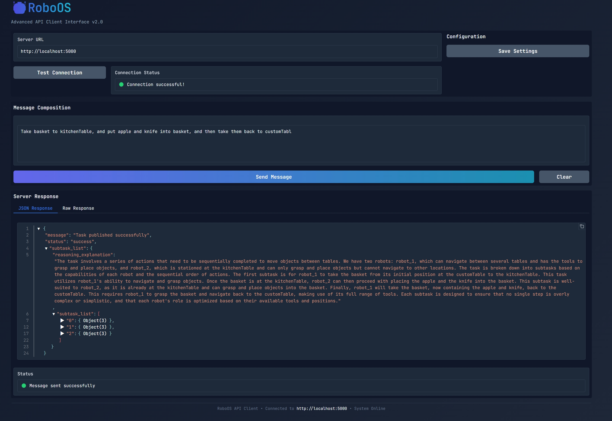
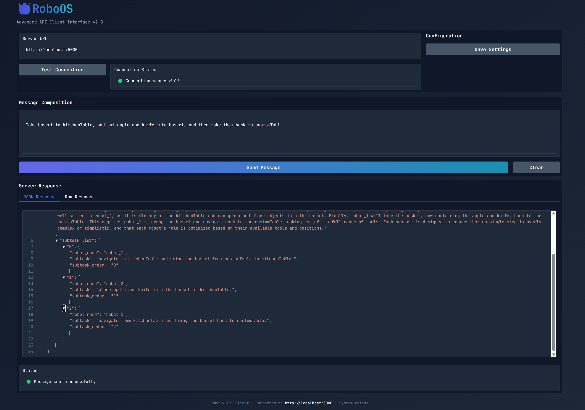
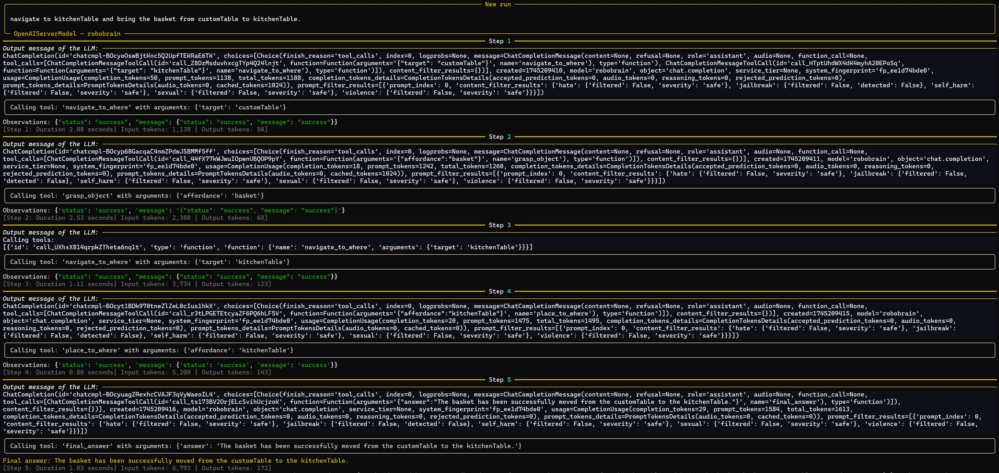
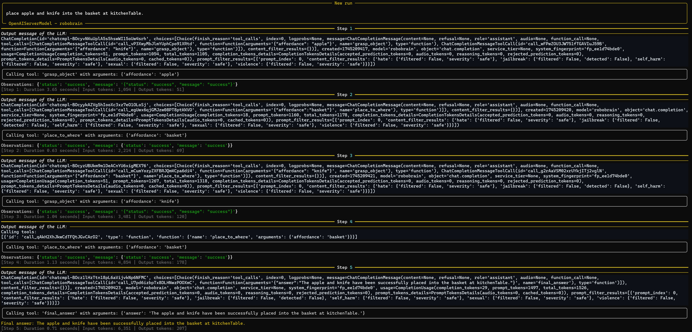
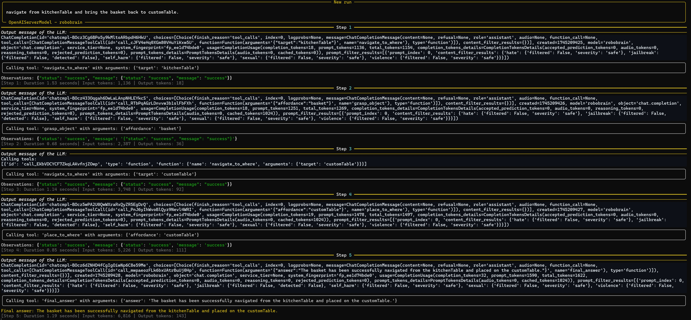

<div align="center">

</div>

# RoboOS
RoboOS: A Hierarchical Embodied Framework for Cross-Embodiment and Multi-Agent Collaboration

<p align="center">
    </a>&nbsp&nbsp⭐️ <a href="">Project (Coming soon)</a></a>&nbsp&nbsp │ &nbsp&nbsp🌎 <a href="">Demo (Coming soon)</a>&nbsp&nbsp │ &nbsp&nbsp📑 <a href="https://arxiv.org/abs/2505.03673">Technical Report</a>&nbsp&nbsp </a>
</p>

<p align="center">
</a>&nbsp&nbsp🤖 <a href="https://github.com/FlagOpen/RoboBrain/">RoboBrain</a>: A Unified Brain Model for Robotic Manipulation from Abstract to Concrete.
</p>

## 🔥 Overview
The rise of embodied intelligence has intensified the need for robust multi-agent collaboration in industrial automation, service robotics, and smart manufacturing. However, current robotic systems struggle with critical limitations, including poor cross-embodiment adaptability, inefficient task scheduling, and inadequate dynamic error correction. While end-to-end vision-language-action (VLA) models (e.g., OpenVLA, RDT, Pi-0) exhibit weak long-horizon planning and task generalization, hierarchical VLA models (e.g., Helix, Gemini-Robotics, GR00T-N1) lack cross-embodiment compatibility and multi-agent coordination capabilities.
To address these challenges, we present **RoboOS**, the first open-source embodied operating system based on a *Brain-Cerebellum* hierarchical architecture, facilitating a paradigm shift from single-agent to swarm intelligence. Specifically, RoboOS comprises three key components: **(1) the Embodied Cloud Model**, a multimodal large language model (MLLM) for global perception and high-level decision-making;  **(2) the Cerebellum Skill Library**, a modular, plug-and-play toolkit for seamless multi-skill execution; and  **(3) Real-Time Shared Memory**, a spatiotemporal synchronization mechanism for multi-agent state coordination. By integrating hierarchical information flow, RoboOS bridges the Embodied Brain and Cerebellum Skill Library, enabling robust planning, scheduling, and error correction for long-horizon tasks while ensuring efficient multi-agent collaboration by Real-Time Shared Memory. Moreover, we optimize edge-cloud communication and cloud-based distributed inference to support high-frequency interactions and scalable deployment.
Extensive real-world experiments across diverse scenarios (e.g., restaurant, household, supermarket) demonstrate RoboOS’s versatility, supporting heterogeneous embodiments (single-arm, dual-arm, humanoid, wheeled), which provides a scalable and practical solution for cross-embodiment collaboration, pushing the boundaries of embodied intelligence.
<div align="center">

</div>


## <a id="RoadMap"> 🎯 RoadMap</a>
- [x] Release **RoboOS-Preview** version
- [x] Release **[Technical Report](https://arxiv.org/abs/2505.03673)** of RoboOS.
- [ ] Release **RoboOS-​Official** version *(by the end of this month)*
- [ ] Release friendly and detailed **User Guide Manual**​.
- [ ] Release more comprehensive multi-agent collaboration **DEMOs** based on RoboOS​.

## <a id="Manual"> ⭐️ Full Guide Manual (RoboOS-Official)
*Coming soon ...*

Due to the substantial code refactoring and engineering efforts required, we'll need to postpone the release by *several days*. We appreciate your patience as we ensure the highest quality standards.


## <a id="Manual"> ⭐️ Simple Guide Manual (Only for RoboOS-Preview)</a>

### 1. Prerequisites

- Python 3.8+
- Redis server
- pip package manager

### 2. Installation

```bash
# Clone the repository
git clone https://github.com/FlagOpen/RoboOS.git
cd RoboOS

# Install dependencies
pip install -r requirements.txt

```

### 3. Quick Start
```bash
# 1. Start Redis
redis-server

# 2. Start Master
python master/run.py

# 3. Start Slaver (for multi-agent, your should run at different robots respectively)
python slaver/run.py

# 4. Launch Web Interface
python gradio_ui.py

# Then, access the web interface at: http://localhost:7861
```

## ✨ Example Demo

### 🔍 Master Console

<div align="center">

</div>

<div align="center">

</div>

### 🤖 Slaver Console

#### Subtask_1 for Realman Single-ARM Robot

<div align="center">

</div>


#### Subtask_2 for Agilex Dual-ARM Robot

<div align="center">

</div>


#### Subtask_3 for Realman Single-ARM Robot

<div align="center">

</div>


## <a id="Citation"> 📑 Citation</a> 
If you find this project useful, welcome to cite us.
```bib
@article{tan2025roboos,
  title={RoboOS: A Hierarchical Embodied Framework for Cross-Embodiment and Multi-Agent Collaboration}, 
  author={Tan, Huajie and Hao, Xiaoshuai and Lin, Minglan and Wang, Pengwei and Lyu, Yaoxu and Cao, Mingyu and Wang, Zhongyuan and Zhang, Shanghang},
  journal={arXiv preprint arXiv:2505.03673},
  year={2025}
}

@article{ji2025robobrain,
  title={RoboBrain: A Unified Brain Model for Robotic Manipulation from Abstract to Concrete},
  author={Ji, Yuheng and Tan, Huajie and Shi, Jiayu and Hao, Xiaoshuai and Zhang, Yuan and Zhang, Hengyuan and Wang, Pengwei and Zhao, Mengdi and Mu, Yao and An, Pengju and others},
  journal={arXiv preprint arXiv:2502.21257},
  year={2025}
}
```
