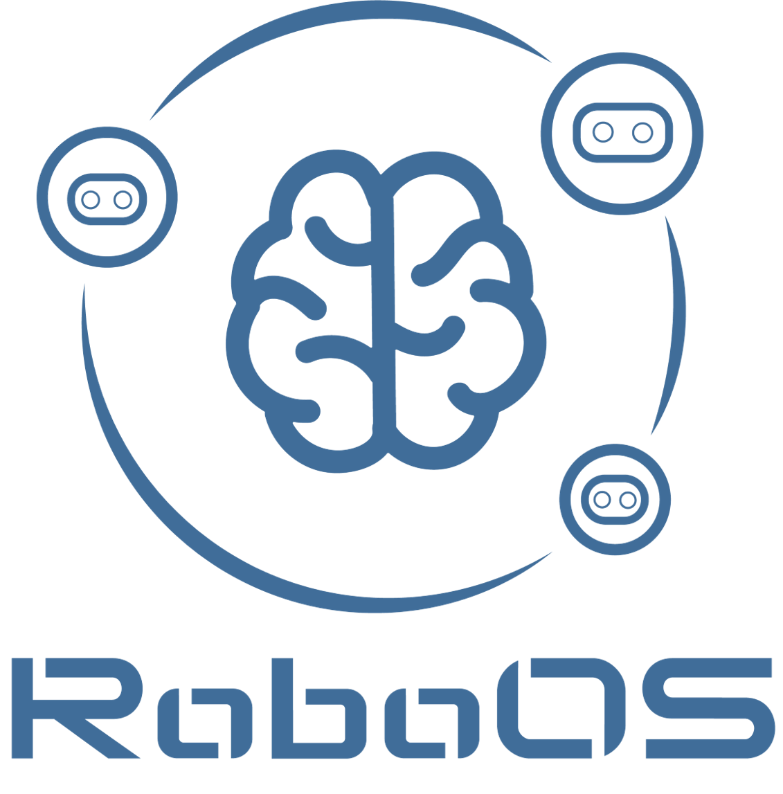
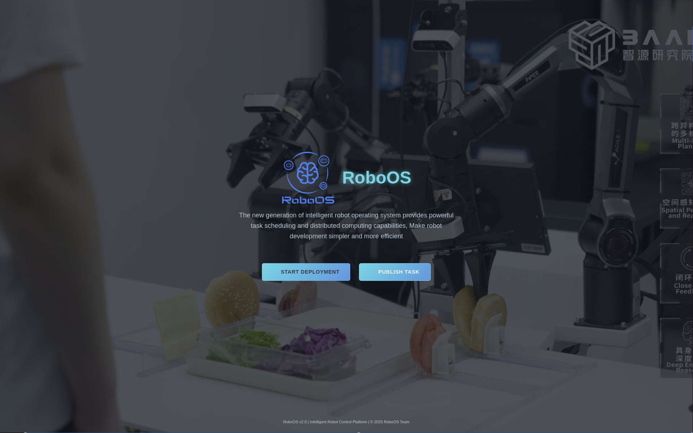
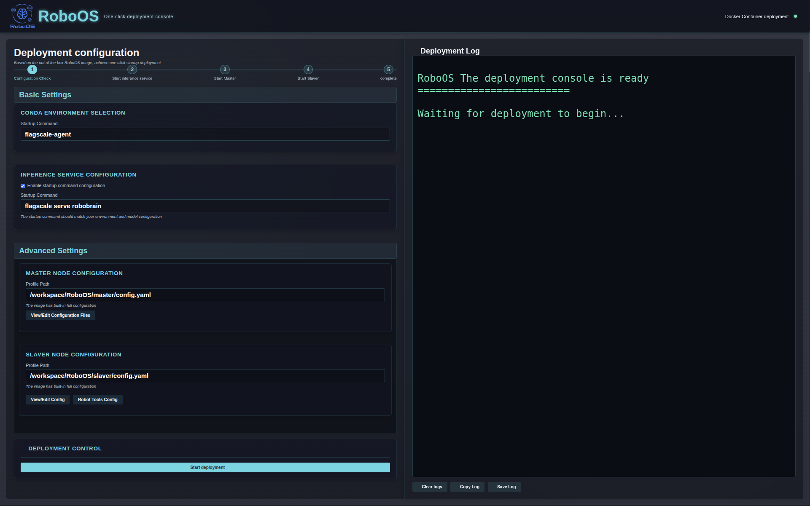
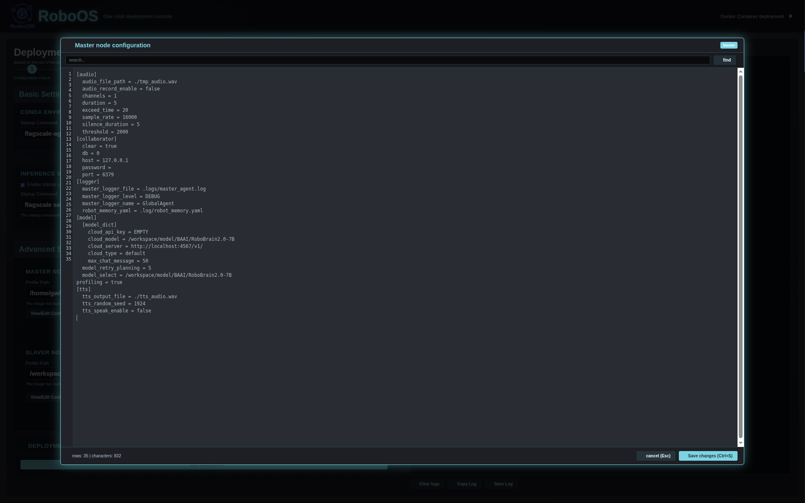
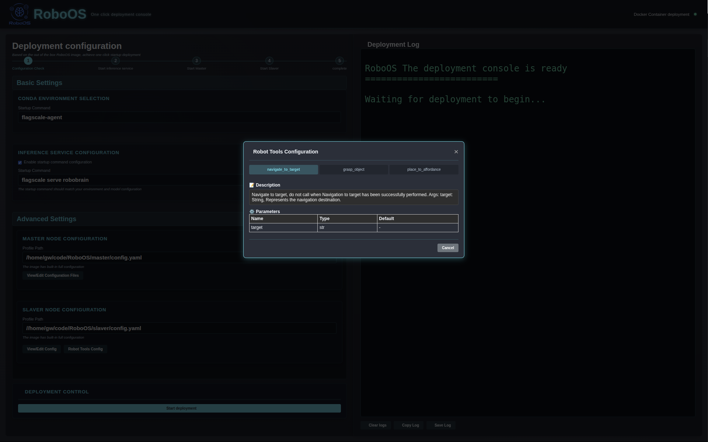
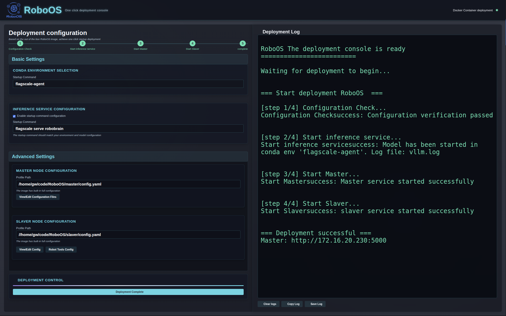
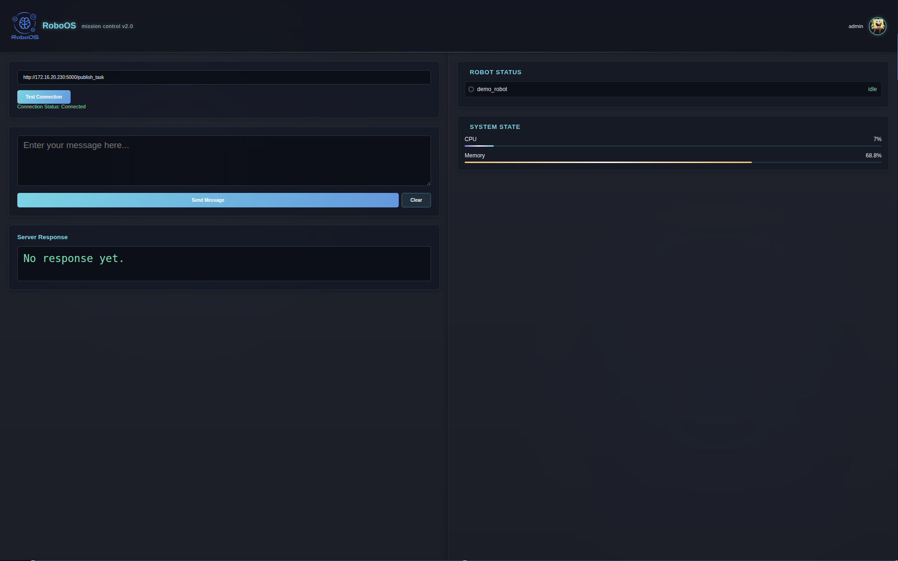
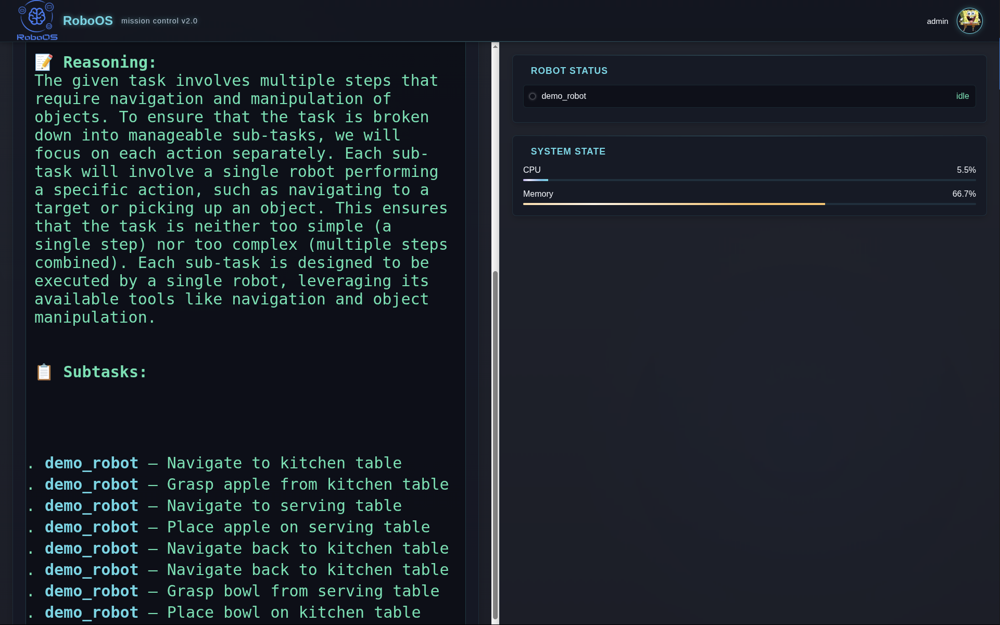

<div align="center">

</div>

# RoboOS
RoboOS: A Hierarchical Embodied Framework for Cross-Embodiment and Multi-Agent Collaboration

<p align="center">
    </a>&nbsp&nbsp⭐️ <a href="">Project (Coming soon)</a></a>&nbsp&nbsp │ &nbsp&nbsp🌎 <a href="">Demo (Coming soon)</a>&nbsp&nbsp │ &nbsp&nbsp📑 <a href="https://arxiv.org/abs/2505.03673">Technical Report</a>&nbsp&nbsp </a>
</p>

<p align="center">
</a>&nbsp&nbsp🤖 <a href="https://github.com/FlagOpen/RoboBrain2.0/">RoboBrain 2.0</a>: Advanced version of RoboBrain. See Better. Think Harder. Do Smarter.
</p>

<p align="center">
</a>&nbsp&nbsp🤖 <a href="https://github.com/FlagOpen/RoboBrain/">RoboBrain 1.0</a>: A Unified Brain Model for Robotic Manipulation from Abstract to Concrete.
</p>

## 🔥 Overview
The rise of embodied intelligence has intensified the need for robust multi-agent collaboration in industrial automation, service robotics, and smart manufacturing. However, current robotic systems struggle with critical limitations, including poor cross-embodiment adaptability, inefficient task scheduling, and inadequate dynamic error correction. While end-to-end vision-language-action (VLA) models (e.g., OpenVLA, RDT, Pi-0) exhibit weak long-horizon planning and task generalization, hierarchical VLA models (e.g., Helix, Gemini-Robotics, GR00T-N1) lack cross-embodiment compatibility and multi-agent coordination capabilities.
To address these challenges, we present **RoboOS**, the first open-source embodied operating system based on a *Brain-Cerebellum* hierarchical architecture, facilitating a paradigm shift from single-agent to swarm intelligence. Specifically, RoboOS comprises three key components: **(1) the Embodied Cloud Model**, a multimodal large language model (MLLM) for global perception and high-level decision-making;  **(2) the Cerebellum Skill Library**, a modular, plug-and-play toolkit for seamless multi-skill execution; and  **(3) Real-Time Shared Memory**, a spatiotemporal synchronization mechanism for multi-agent state coordination. By integrating hierarchical information flow, RoboOS bridges the Embodied Brain and Cerebellum Skill Library, enabling robust planning, scheduling, and error correction for long-horizon tasks while ensuring efficient multi-agent collaboration by Real-Time Shared Memory. Moreover, we optimize edge-cloud communication and cloud-based distributed inference to support high-frequency interactions and scalable deployment.
Extensive real-world experiments across diverse scenarios (e.g., restaurant, household, supermarket) demonstrate RoboOS’s versatility, supporting heterogeneous embodiments (single-arm, dual-arm, humanoid, wheeled), which provides a scalable and practical solution for cross-embodiment collaboration, pushing the boundaries of embodied intelligence.

### Structure for RoboOS 2.0 (SaaS + MCP)
<div align="center">

</div>


## <a id="RoadMap"> 🎯 RoadMap</a>
- [x] Release **RoboOS-1.0** version
- [x] Release **[Technical Report](https://arxiv.org/abs/2505.03673)** of RoboOS.
- [x] Release **RoboOS-2.0 stand-alone** s version 
- [ ] Release friendly and detailed **User Guide Manual**​.
- [ ] Release more comprehensive multi-agent collaboration **DEMOs** based on RoboOS​.


## <a id="Manual"> ⭐️ Guide Manual</a>

### 1. Prerequisites

- Python 3.10+
- Redis server
- pip package manager

### 🎥 Deployment Video Tutorial
> 👉 [Click here to watch the deployment tutorial](https://flagopen.github.io/RoboOS/assets/Deployment.mp4) *(Recommended before getting started)*


### 🚀 2. Deployment Methods
Two deployment options are available based on your needs:

#### 🐳 2.1 Method One: Docker Deployment (Recommended)
Recommended for quick setup and production environments.

##### 2.1.1 Pull the Docker Image
```bash
docker pull flagrelease-registry.cn-beijing.cr.aliyuncs.com/flagrelease/flagrelease:flagscale_agent_RoboOS_v2.0
```

##### 2.1.3 Open the Deployment Web Page
```bash
# You may choose to mount the RoboBrain model into the container:

docker run -itd \
    --gpus all \
    --shm-size=500g \
    --name agent \
    --hostname flagscale-agent \
    -v {your_local_path}/BAAI/RoboBrain2.0-7B:/path/in/container \
    --network=host \
    -p 8888:8888 \
    -w /workspace/RoboOS \
    flagrelease-registry.cn-beijing.cr.aliyuncs.com/flagrelease/flagrelease:flagscale_agent_RoboOS_v2.0
```

##### 2.3 Open the Deployment Web Page
```cpp
http://127.0.0.1:8888
```

#### 2.2 Method Two: Run from Source (For Development or Customization)
Recommended for local development, debugging, or feature extension.

##### 2.2.1 Clone the Repository
```bash
git clone -b stand-alone https://github.com/FlagOpen/RoboOS.git
cd RoboOS
```

##### 2.2.2 Install Dependencies

```bash
# It is recommended to use a virtual environment:

pip install -r requirements.txt

# Install flag_scale from GitHub

git clone https://github.com/FlagOpen/FlagScale 
cd FlagScale
git checkout a0687db035ba1d9c7b2661d8142ee4e8348b1459

# Install in editable mode with PYTHONPATH
PYTHONPATH=./:$PYTHONPATH pip install . --verbose --no-build-isolation 
```

##### 2.2.3 Start the Deployment Service
```bash
cd deploy

python run.py
```
##### 2.2.4 Open the Deployment Web Page
```cpp
http://127.0.0.1:8888
```

### ⚙️ 3. Skill Store Configuration
RoboOS supports two modes for accessing robot skills: **Local Mode** and **Remote Mode.**
For detailed instructions on configuring specific robot skills (e.g., Realman RMC-LA), please refer to the dedicated documentation below:

>📘 [Realman RMC-LA Skill README](https://github.com/FlagOpen/RoboSkill/blob/main/realman/RMC-LA/README.md)
>Includes setup instructions, example skills, and integration guide for Realman robots.

#### ✅ Local Mode
1. Clone the RoboSkill repository:
```bash
git clone https://github.com/FlagOpen/RoboSkill
```

2. Place `skill.py` at the local path specified in the web UI
```bash
Example: slaver/demo_robot_local/skill.py
```

#### 🌐 Remote Mode
1. Host the `skill.py` file on a remote server accessible over the network (Robot)
2. Start the skill server:
```bash
python skill.py
```

### ✅ 4. Final Step
Visit the web UI at http://127.0.0.1:8888 and follow the on-screen instructions to complete configuration.
Once finished, you can control the robot and trigger skills from the interface.

## 🔧 Manual Deployment (Advanced)
If you prefer to manually run RoboOS without using the deployment web UI, follow the steps below to start the system components directly from source.

### 1️⃣ Start the Master Agent
The **master** is responsible for receiving tasks, decomposing them, and assigning subtasks to available slaver agents.

```bash
cd master

python run.py
```
>⚠️ You must start the master agent first, otherwise the slaver will fail to register.

### 2️⃣ Start the Slaver Agent
The **slaver** connects to the master and executes the assigned subtasks on the physical robot.

```bash
cd slaver
python run.py
```
You can run multiple slaver agents on different robots or terminals, each connected to the same master.

### 📤 Sending Tasks Manually
After starting both the **master** and **slaver** agents, you can send tasks in either of the following ways:

#### ✅ Option 1: Use Python Script (Direct HTTP Request)
```bash
import requests

# Replace with your master agent's actual IP or hostname
MASTER_URL = "http://localhost:5000/publish_task"

payload = {
    "task": "Now you are at the kitchen table, pick up the apple from the kitchen table, navigate to the serving table, place the apple on the serving table, pick up the bowl from the serving table, navigate to the kitchen table, place the bowl on the kitchen table."
}

response = requests.post(MASTER_URL, json=payload)

print("Status:", response.status_code)
print("Response:", response.json())

```
> Make sure the master service is running and accessible on port 5000.

#### ✅ Option 2: Use the Release Deployment Web Interface
You can also start the deployment service and access a simple web-based task submission interface:
```bash
cd deploy
python run.py

# Then visit: http://127.0.0.1:8888/release
```

## ✨ Example Demo

### Web-Based Deployment and Configuration
After launching the container or running the deployment script, you can access the RoboOS deployment interface in your browser at:
```cpp
http://127.0.0.1:8888
```
<div align="center">

</div>


#### Click the Start Deployment button to begin configuring your system.

<div align="center">

</div>

You’ll then be guided through several steps:

##### Basic Settings

1. **Conda Environment Selection:** Select the conda environment to run
2. **🧠 Inference Service Configuration**  
  During the deployment process, you will be asked whether to enable the **Inference Service Configuration** option:
  + ✅ Checked: A built-in inference service will be automatically started inside the container.
  + ❌ Unchecked: You can connect to your own externally hosted inference service instead (e.g., RoboBrain running on a remote server).


##### Advanced Settings

Here you can customize and inspect advanced configurations before starting the deployment:

1. **Master Agent Configuration:**
  <div align="center">
  
  </div>

2. **Slaver Agent Configuration:**
  <div align="center">
  
  </div>

3. **Robot Tools Config**
Preview the registered skills available to the robot.
  > ⚠️ Ensure the skill service is already running before checking this section.

  <div align="center">
  
  </div>

4. **Start Deployment**
After completing the setup, click **Start Deployment** to launch the system.
  <div align="center">
  
  </div>


### 🚀 Task Publishing and Execution
After deployment, you can send tasks to the system for execution:

#### 📝 Step 1: Click the Publish Task button
  <div align="center">
  
  </div>

#### 📤 Step 2: Send a Natural Language Task Command
Example:

  ```bash
  Now you are at the kitchen table, pick up the apple from the kitchen table, navigate to the serving table, place the apple on the serving table, pick up the bowl from the serving table, navigate to the kitchen table, place the bowl on the kitchen table.
  ```

#### ⚙️ Step 3: Task Decomposition and Execution Results
The master agent will automatically decompose the task into subtasks and assign them to the
  <div align="center">
  
  </div>
  
#### 

## <a id="Citation"> 📑 Citation</a> 
If you find this project useful, welcome to cite us.
```bib
@article{tan2025roboos,
  title={RoboOS: A Hierarchical Embodied Framework for Cross-Embodiment and Multi-Agent Collaboration}, 
  author={Tan, Huajie and Hao, Xiaoshuai and Lin, Minglan and Wang, Pengwei and Lyu, Yaoxu and Cao, Mingyu and Wang, Zhongyuan and Zhang, Shanghang},
  journal={arXiv preprint arXiv:2505.03673},
  year={2025}
}

@article{ji2025robobrain,
  title={RoboBrain: A Unified Brain Model for Robotic Manipulation from Abstract to Concrete},
  author={Ji, Yuheng and Tan, Huajie and Shi, Jiayu and Hao, Xiaoshuai and Zhang, Yuan and Zhang, Hengyuan and Wang, Pengwei and Zhao, Mengdi and Mu, Yao and An, Pengju and others},
  journal={arXiv preprint arXiv:2502.21257},
  year={2025}
}
```
